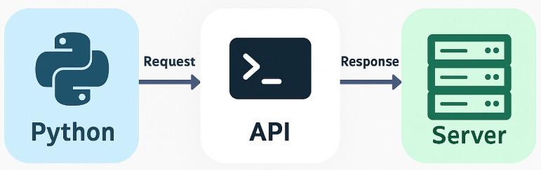

# Digital Ecosystem - Python APIs
This repository contains Python code examples for interacting with APIs. It is designed for students learning about APIs and digital systems in the Digital Ecosystem (DES) course.

# About This Repo:
In this repo, we demonstrate how to use APIs with Python by creating simple scripts that fetch data from external sources. We will also learn how to create a virtual environment and manage dependencies for better isolation and project-specific development.

This repository will be updated with more API examples, along with explanations and walkthroughs of how to interact with different kinds of APIs in Python.



## NOTE: 
If you need a full review about using modules and packages with python though the installing of a virtual environment, you can refer to my repo ["Python Modules & Packages"](https://github.com/anmarjarjees/python-modules-packages).

# Workflow for This Repo:
1. Set up a Virtual Environment:
Start by creating a virtual environment to isolate your Python dependencies.

2. Install Required Packages:
Use the pip tool to install any required packages, such as requests, to work with APIs.

3. Create Python Scripts for API Interaction:
We will use Python scripts to interact with APIs, starting with basic examples and moving to more complex ones.

## Step 1: Creating a Virtual Environment
To create a virtual environment, follow these steps:
1. Create a Virtual Environment Folder:
    - In your project directory, run the following command:
    ```
    python -m venv venv
    ```
2. Activate the Virtual Environment:
    - Windows:
        ```
        .\venv\Scripts\activate
        ```
    - MacOS/Linux:
        ```
        source venv/bin/activate
        ```
After activating the environment, you'll notice the virtual environment name (example: venv) in your command prompt.

## Step 2: Installing Required Packages
- Install the necessary packages, such as **requests**, run:
```
pip install requests
```
- Save the dependencies by creating a requirements.txt file:
```
pip freeze > requirements.txt
```
- This file **"requirements.txt"** can then be used to install dependencies with:
```
pip install -r requirements.txt
```

# File 1 (api1_intro_request): Introduction to APIs and Requests
This file explains the basics of APIs and how to make HTTP requests in Python using the requests library.

**Key Concepts Covered:**
- What is an API?
- How APIs communicate using HTTP (requests and responses).
- How to use the requests library to send basic GET requests.
The requests library is a simple and user-friendly HTTP library in Python. We'll use it to interact with various public APIs.

# File 2 (api2_weather_map.py): Fetching Weather Data Using OpenWeatherMap API (Conceptual)
This file demonstrates how to fetch current weather data for a given city using the OpenWeatherMap API.
**Steps:**
1. Sign up for a free API key at OpenWeatherMap.org. (Note: An API key is required even for free usage)
    - Notice that you need to sign up for an API key to use the OpenWeatherMap API, even for basic usage. They require this to monitor usage and enforce rate limits, even on their free tier.
2. Use your API key to make a **GET** request to the weather endpoint.
3. Extract and display relevant information from the API response (example: temperature, weather description).

However, for quick demonstration, I will use my personal JSON API repo as explained in "File3":
 - https://anmarjarjees.github.io/json-examples/music-inst.json

# File 3 (api3_music_json.py): Demo API (No Key Required)
This file uses a custom public JSON API hosted by me. It demonstrates how to fetch and display structured data of "musical instruments" with no authentication needed:
```
https://anmarjarjees.github.io/json-examples/music-inst.json
```
**Steps:**
1. Making a GET request to a public JSON API.
2. Parsing JSON.
3. Looping through arrays and nested data.
4. Clean and structured output.

# File 4 (api4_query_params.py): Using Query Parameters in API Requests
This file demonstrates how to pass query parameters (like filtering or searching) in a GET request using the same custom JSON API of musical instruments:
```
https://anmarjarjees.github.io/json-examples/music-inst.json
```
**Steps:**
1. Define query-like parameters (example: instrument type or category).
2. Simulate filtering logic in Python (since the demo API is static).
3. Demonstrate how query parameters normally work with real APIs.
4. Practice conditional logic, looping, and clean output formatting.

# File 5 (api5_web_scrape.py): Basic Web Scraping Using BeautifulSoup
Demonstrates how to scrape and extract information from a basic HTML structure using Python's requests and BeautifulSoup libraries. We will extract data from an HTML page using the **BeautifulSoup library** as one of the most popular tools for web scraping in Python.
Note: This is a conceptual, beginner-friendly example using a simple local HTML file (not from the internet).

## What is Web Scraping?
Web scraping means programmatically fetching the content of a web page and extracting useful data from it. It's useful when:
- No API is provided
- We only need to grab structured text (like titles, tables, or links)

**Note: Always check a website’s robots.txt or terms of service before scraping it**

**Steps:**
1. Prepare a sample sample.html file containing structured content (example: a list of instruments).
2. Use BeautifulSoup to parse the HTML.
3. Extract and display specific elements (like headings, list items, etc.).

**Tools Used:**
- requests: To fetch the HTML content of the page
    - Link: [Requests: HTTP for Humans](https://requests.readthedocs.io/en/latest/)
- BeautifulSoup (bs4) – To parse and extract elements from the HTML
    - **BeautifulSoup** from **bs4** (BeautifulSoup version 4) which is the official Python package name you use when installing the BeautifulSoup library.
    - Link: [BeautifulSoup Documentation](https://www.crummy.com/software/BeautifulSoup/bs4/doc/)

**Learning Demo:**

We will use a small local HTML string in our script — no need to scrape the real web in this educational example:
1. How to fetch or define an HTML page
2. How to parse HTML with BeautifulSoup
3. How to extract elements like:
    - Page title
    - List items
    - Links
    - Table content (optional)

**Using BeautifulSoup:**
- Install it via pip:
```
pip install beautifulsoup4
```
- Use it in Python:
```
from bs4 import BeautifulSoup
```

# Summary of Process:
1. Set up the virtual environment using virtualenv_setup.py.
2. Install dependencies from the requirements.txt.
3. Demonstrate an API example (example: weather data) with weather_api.py.
4. Include another API example (example: cryptocurrency or movie data) with another_api_example.py.

---

# Resources, References, and Credits:
- My Other Python Repositories:
    - [Python Weekly Classes](https://github.com/anmarjarjees/py-code)
    - [Python for Full-Stack Development](https://github.com/anmarjarjees/fssd-python)
    - [Python Modules & Packages](https://github.com/anmarjarjees/python-modules-packages)
    - [Python Web Scraping](https://github.com/anmarjarjees/py-web-scraping)
    - [Python More Advanced Topics](https://github.com/anmarjarjees/python-extra)
- [OpenWeatherMap API Documentation](https://openweathermap.org/api)
- [Requests Documentation](https://docs.python-requests.org/en/latest/)
- [Python Documentation](https://docs.python.org/3/)
- [Virtual Environments](https://docs.python.org/3/library/venv.html)

---

# Tips and Hints
- Markdown Language - Basic writing and formatting syntax:
    - [Writing on GitHub - Basic formatting syntax](https://docs.github.com/en/get-started/writing-on-github/getting-started-with-writing-and-formatting-on-github/basic-writing-and-formatting-syntax)
- Searching for Free API providers could be risky sometimes! Below are useful websites for checking:
    - [Google Safe Browsing](https://transparencyreport.google.com/safe-browsing/search)
        - Google's own service checks whether a site is reported as dangerous or deceptive
    - [VirusTotal](https://www.virustotal.com/)
        - Upload a file or paste a URL; it scans it using 70+ antivirus engines
    - [Norton Safe Web](https://safeweb.norton.com/)
        - Enter a URL to see if Norton has flagged it as unsafe
    - [URLVoid](https://www.urlvoid.com/)
        - Shows reputation reports from multiple security services
    - [Trend Micro Site Safety Center](https://global.sitesafety.trendmicro.com/)
        -  Check if a website is dangerous or contains malicious content

